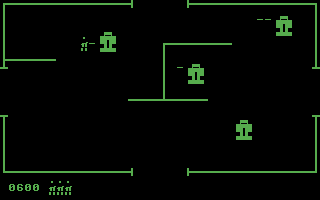

# Petzerk

**Petzerk BASIC 1.0** — REM Recreation of the classic arcadegame "Bezerk" in XC-BASIC for the Commodore PET

- **Author:** Chris Garrett  
- **Year:** 2026  
- **Website:** [RetroGameCoders.com](https://retrogamecoders.com)

## Overview

Petzerk brings the arcade action of Bezerk to the vintage Commodore PET. Navigate maze corridors, blast enemies with your laser, and avoid being eliminated.

## Requirements

- **XC-BASIC** compiler for the Commodore PET
- Commodore PET with screen memory at `32768` (40 columns)

## Controls

| Key | Action        |
|-----|---------------|
| **W** | Move up      |
| **A** | Move left    |
| **S** | Move down    |
| **D** | Move right   |
| **Space** | Fire laser |
| **Q** | Quit game   |

## Running the Game

1. Compile `petzerk.bas` using XC-BASIC.
2. Load and run the resulting program on your PET or emulator.

## Files

- `petzerk.bas` — Source code (XC-BASIC)
- `petzerk.c`  — Example mockup screen layout as C data file

---
## License

This project is licensed under the GNU General Public License (GPL) v3. You are free to use, modify, and distribute this software under the terms of the GPL, including creating derivative works, provided you keep the same license and make source code available. See the [full license text](https://www.gnu.org/licenses/gpl-3.0.html) for details.
